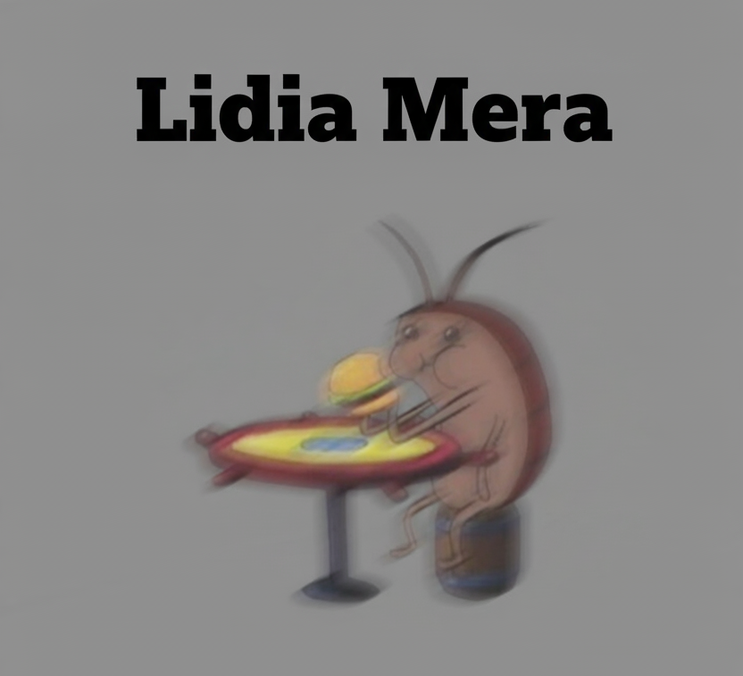

Soy estudiante de **Ingeniería Mecatrónica** en **séptimo semestre**.  
 💻 Lenguajes de Programación
    - Java (Programación Orientada a Objetos)  
    - C (Programación estructurada)  
    - Python (En aprendizaje)  

---
 ⚙️ Conocimientos en Manufactura
    -  Operación de máquinas CNC router y freasadora  
    - Corte por plasma
    - Torno paralelo
    - Fresadora vertical  

---
 🎨 Herramientas de Diseño
    - Manejo de software CAD
